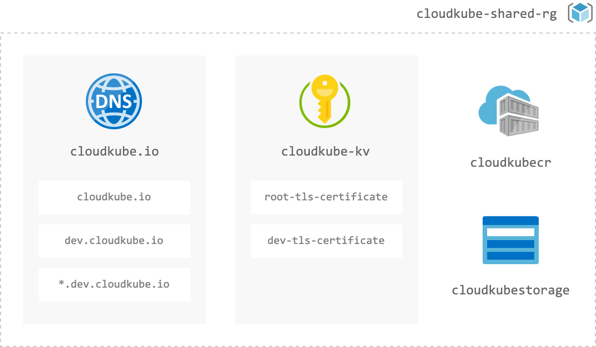

# Shared Infrastructure - cloudkube.io

[Terraform](https://registry.terraform.io/providers/hashicorp/azurerm/latest/docs) Infrastructure as Code (IaC) I use to deploy and manage shared resources for cloudkube.io

```bash
$ az resource list -o table -g cloudkube-shared-rg

Name                  ResourceGroup        Location     Type                                    
--------------------  -------------------  -----------  --------------------------------------
cloudkubestorage      cloudkube-shared-rg  northeurope  Microsoft.Storage/storageAccounts
cloudkubecr           cloudkube-shared-rg  northeurope  Microsoft.ContainerRegistry/registries
cloudkube.io          cloudkube-shared-rg  global       Microsoft.Network/dnszones
cloudkube-prod-kv     cloudkube-shared-rg  northeurope  Microsoft.KeyVault/vaults
cloudkube-staging-kv  cloudkube-shared-rg  northeurope  Microsoft.KeyVault/vaults
cloudkube-dev-kv      cloudkube-shared-rg  northeurope  Microsoft.KeyVault/vaults
```



_Diagram: shared resources (outdated)_

## Terraform -  Infra as Code

### Configuration

| File | Description | InnerSource? |
|:--|:--|:--|
| `dns.auto.tfvars` | A and CNAME records for root domain. | Example |
| `ingress.auto.tfvars` | For my convenience. Not a common use case. | No |
| `main.tfvars` | Configuration to deploy shared infrastructure | No |

### Terraform Syntax References

In case you're trying to wrap your head around the Terraform code examples like this one…

```terraform
output "certificate_role_assginments" {
  value = [
    for k, v in zipmap( 
      keys(azurerm_role_assignment.ingress_mi_kv_readers),
      values(azurerm_role_assignment.ingress_mi_kv_readers)) : {
      tostring(k) = {        
        scope          = v.scope
        principal_name = data.azurerm_user_assigned_identity.ingress_managed_ids[k].name
        principal_rg   = data.azurerm_user_assigned_identity.ingress_managed_ids[k].resource_group_name
      }
    }
  ]
}
```

…please see the Terraform documentation:

- [Expressions - `for`](https://www.terraform.io/docs/language/expressions/for.html)
- [Functions - `zipmap`](https://www.terraform.io/docs/language/functions/zipmap.html)
- [Resources - `for_each` meta argument](https://www.terraform.io/docs/language/meta-arguments/for_each.html)

---

## InnerSource Infrastructure Example 

In real life, you would probably want to separate these repos into distinct domains, e.g. routing vs firewall whitelisting. This repo exists primarily to make my workflow easier.

### Developer Self-Service

You can view [`dns.auto.tfvars`](./dns.auto.tfvars) as an example of how to leverage git and Pull Requests to manage changes to shared infrastructure.

Note to streamline the workflow process, it is important to have very clear instructions to developers on how to make changes that adhere to standards/conventions, which are set by the maintainers of the infrastructure.

#### _Example Instructions_

I recommend also including a shortened version in the source code where developers make changes.

> - Fork this repo to your org/user
> - Add another nested map to `dns_a_records` or `dns_cname_records`
> - Create a pull request to the `queued` branch of this repo
> - Important: 
> 	- Key names MUST be unique
> 	- Do not edit any other files or your PR will be rejected.
> - See Readme for further details

### Further Reading

Practical information about InnerSource in practice.

- [GitLab: What is InnerSource?](https://about.gitlab.com/topics/version-control/what-is-innersource/)
- [Zalando: How to InnerSource](https://opensource.zalando.com/docs/resources/innersource-howto/)
- [InnerSource Commons](https://innersourcecommons.org/)

---

## Disclaimer

This repository open source and my opinionated workflow for my use-case. Before you clone it and try it out yourself, please remember it is 

- *not* an official Microsoft recommendation
- *not* a reference architecture
- *not* a reference implementation

## License

MIT